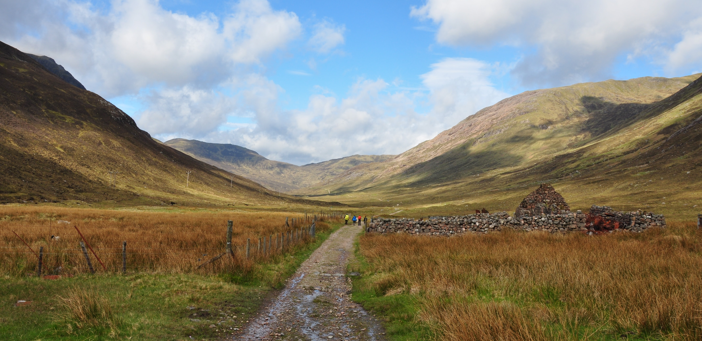
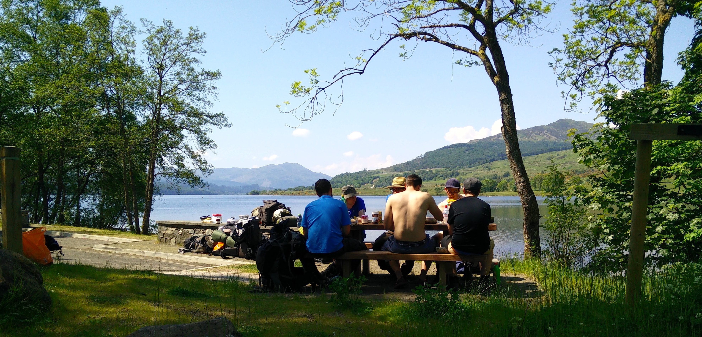
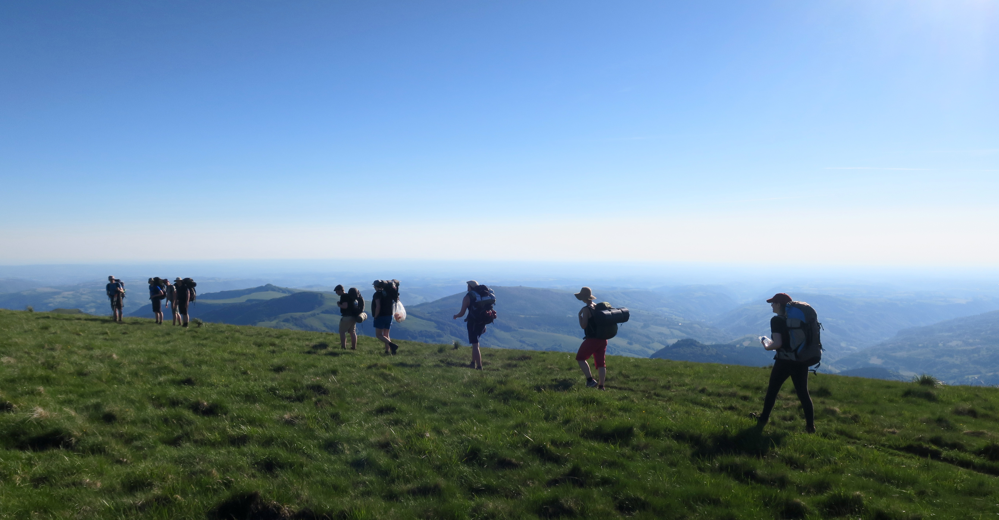

## About

**A week in the woods** is a collection of long-distance hike reports of a group of friends from Berlin. Our fascination with long-distance hikes was started on Europe's most famous trail, the [West Highland Way in Scotland](/scotland/west-highland-way). We fell in love with wild camping and cooking delicious meals in Trangia pots in the most beautiful places in nature.

That first trip then started a tradition among our group of friends to go on a week-long trip together, every year. We always pack most of the food we need for the week and cook meals together breakfast, lunch and dinner. That might add a little more time to the preparation but there's nothing better than a hot meal after a long day of hiking with a heavy backpack.

We hope you enjoy reading our reports and if you do, feel free to reach out to us at the contact details below 💌.

