This hike I wanted to be different than all previous. For the first time, I wanted to guide our group into higher mountains. I also wanted it to be less strenuous than the other hikes before so I planned shorter days. Little did I know how much more exhausting it is to climb mountains, especially when it’s 30°C all day long 😅

<!-- more -->

The Auvergne region in France seemed like the perfect beginner region to start mountaineering. These dormant volcanoes in the center of France are covered in beautiful green pastures and are quite easy to walk on. They are also easily accessible through the public footpaths of the [GR400 - Tour des Volcans du Cantal][].

In total the GR400 is 133km long of which we hiked 52km in three days. It makes for a great combination of a shorter hike and vacation in the countryside in France.

## Itinerary

<iframe src="https://www.google.com/maps/d/u/0/embed?mid=18Hp-H3HSlLKOjw-Og2gOW_VNqrQ"></iframe>

The red markers show the places where we pitched out tents and the blue markers are water sources. There were very few ones which was a problem on the first day (which I will get to in just a second).

## Sections

1. [Le Falgoux to Refuge De Cabrespine (16km)](#section1)
1. [Refuge de Cabrespine to Col de Cabré (19km)](#section2)
1. [Col de Cabré to Le Falgoux (17km)](#section3)

### Day 1: Le Falgoux to Refuge De Cabrespine (16km)

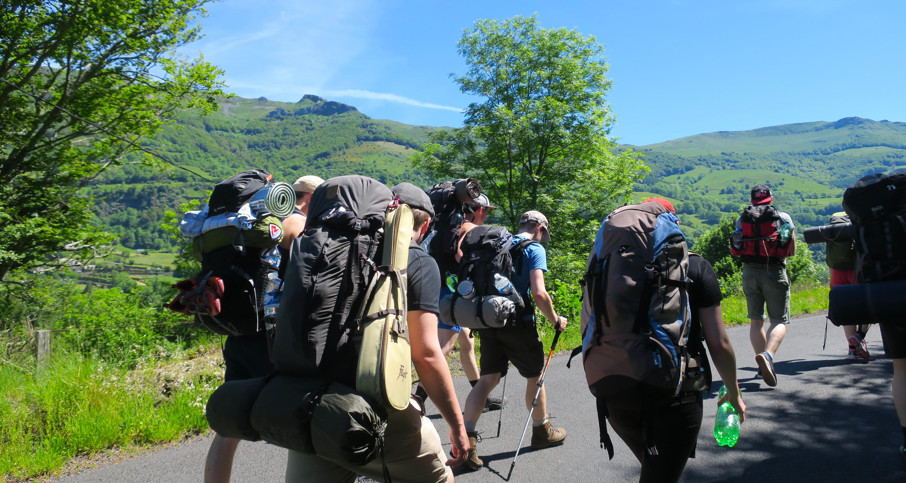
Start from Le Falgoux

Le Falgoux, the village at the beginning of the hike, is around 950m above sea level which makes it an exciting car ride up and through the mountains to get there. Then when you get out of the car and look at the mountains in front of you, you realize that the hardest part has not even started yet.

It was a super sunny day with 29°C, no clouds, sun glaring above our heads. We made sure to pack 4 litres of water each to make it through the first day. According to our maps, the first water source was 3km into the second day, so that water needed to last us all day. Luckily, the ascent onto the volcano mountain goes through a dense forest. Perfectly soft ground and slightly lower temperatures due to the shade. The slope was pretty intense though. 7km in we already covered around 700m in height and we had more to cover to get to the top of the mountains.

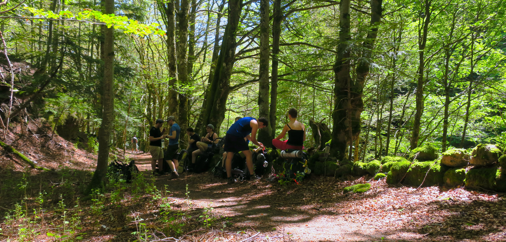
In the forest, protected from the sun

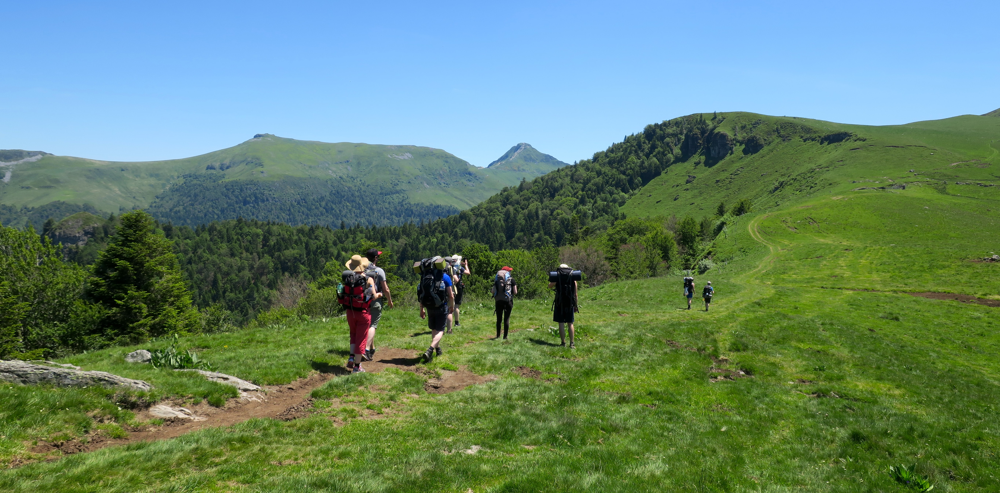
Made it to the "top"

Once we made it to the top of the mountain, we were greeted by beautiful green pastures. It felt great to take a break there and just sit on the soft gras and enjoy the sun.

From there on the walk got a lot easier with less steep slopes and plenty of stunning views to take in. The sun, however, became a problem at that point because there was no shade anywhere and we had to cover ourselves in thick layers of sunscreen. Mild winds cooled down the heavy heat a bit and we enjoyed to hiking on those beautiful green ridges.

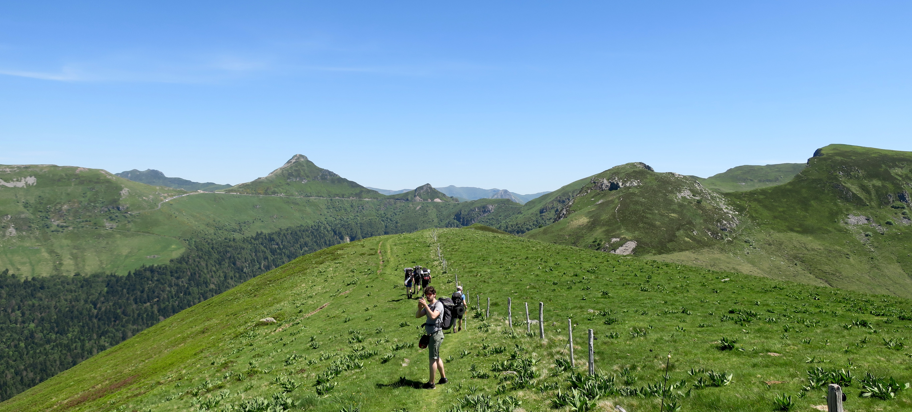
Scenic hike on the green ridges with **Puy Mary** in the background

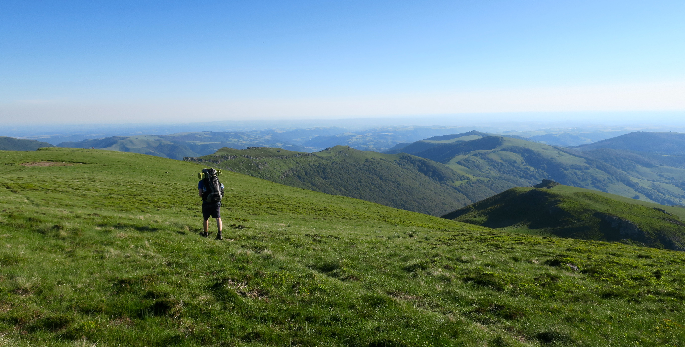
Enjoying the view

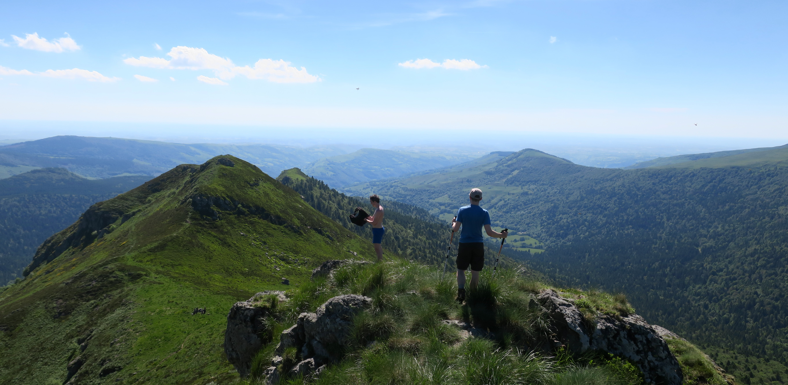
Some of us took detours exploring the peaks

A couple of kilometers before where we wanted to stop for the night we realized we were running out of water a lot quicker than we expected. It was mentioned in the guide that it would be hard to find sources on the first section, so we stopped to check our map for water sources and sure enough we found one not too far off the trail. The only problem was that this source was down a steep pasture and not visible from our location.

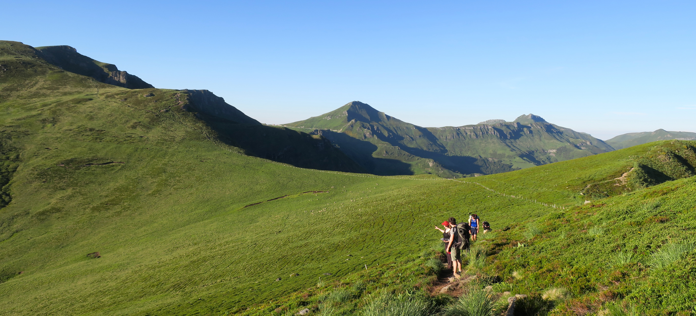
Trying to spot the water source

We trusted in our map and sent an exploration group down the valley. We lost sight of them and after what seemed an eternity we could see them again, triumphally holding up the filled bottles into the air. A great moment of success for the group which motivated everyone to make it to the finish line today.

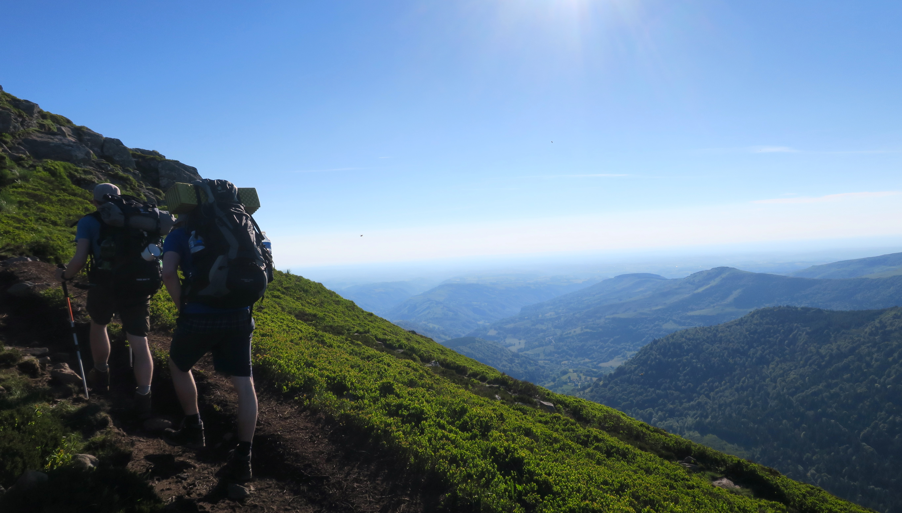
Up and down the hills

Making it over the last hill before the night

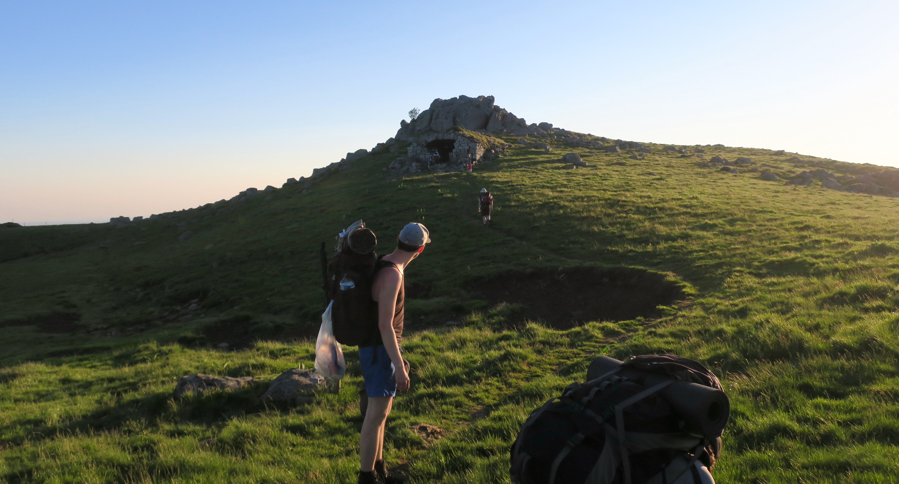
Arrival at Refuge the Cabrespine

We set up camp next to a the **Refuge De Cabrespine**. A perfectly flat camping spot with wind protection. For dinner we hiked up a little peak where we watched sun go down slowly. Around that time we also had some curious cows coming up to our tents. We probably pitched them at a spot where they usually come in for the night. After licking half our tents and staring at us for about half an hour they could not be bothered by our presence anymore and continued up the mountain.

### Day 2: Refuge de Cabrespine to Col de Cabré

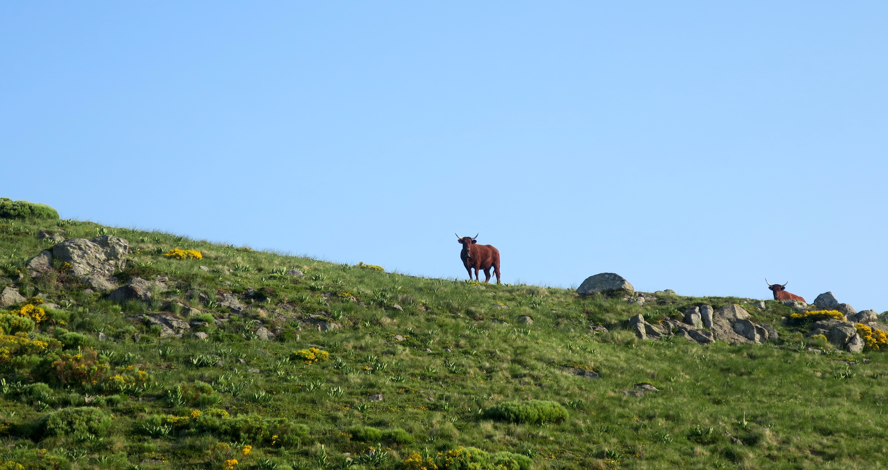
Our neighbours observing us in the morning

The second day started with a long descent into the village of **Mandailles**. The first 12km we hiked downhill exclusively back to back to 950m altitude from around 1600m. It was less hot in the morning and we again walked through forests that protected us from the strong sun.

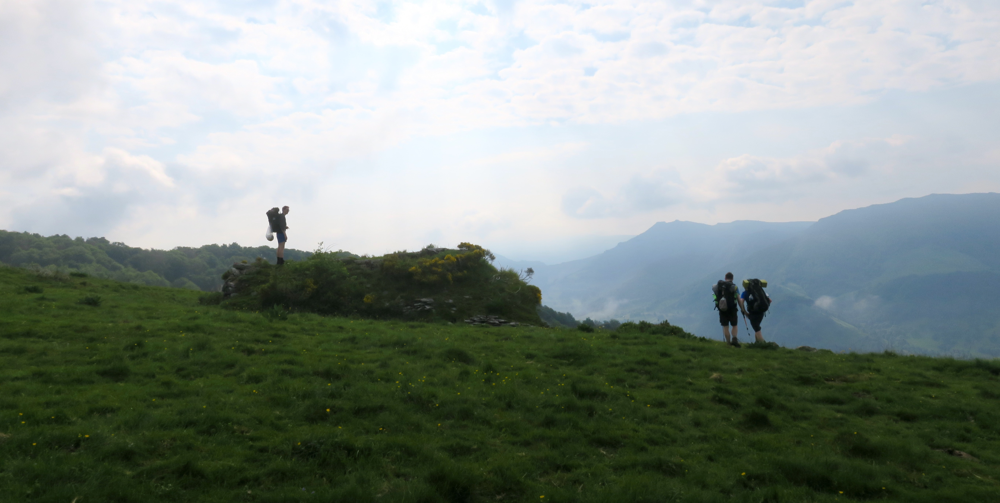
Looking down into the valley

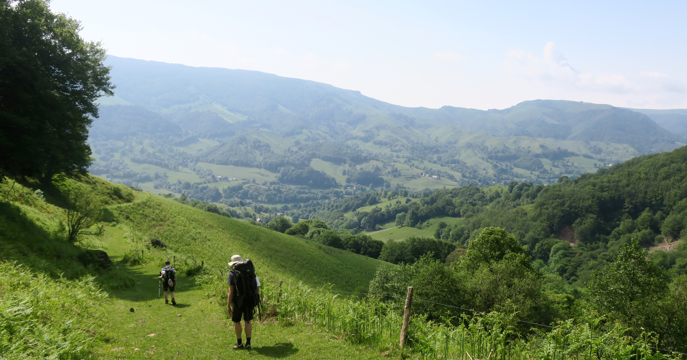
The valley of Mandailles

In Maindailles we found a sweet little Restaurant ([Au Bout du Monde][]) with great local food. We got introduced to the hearty **Aligot** which is a mixture of potato mash, butter, cream and local cheeses. A perfect energy refill after that long hike down into the valley. They also offered steak platters made from the meat of the typical red cows of the region that you would see everywhere along the hike.

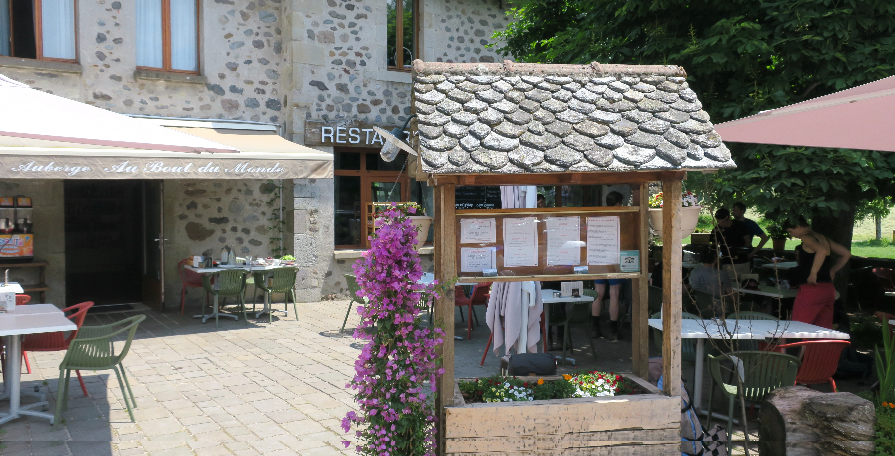
Auberge - Au Bout Du Monde

We took a longer break at the restaurant because we knew what was ahead of us. We came to Auvergne for the mountains after all and we had to climb around 500m next. We also had to be a bit faster this time because we agreed to meet a friend at the top of the mountain at a specific time. So naturally we tried to shortcut the path where we could and most of the time the shortcuts were easy to reach.

A rather steep shortcut

The final shortcut looked like a regular path along a creek on our maps. We found the creek, but no regular path. Nonetheless we wanted to get to our meeting point quickly so we started to wade through knee deep foliage with a crazy steep ascent. Hiking sticks and good shoes were definitely helping a lot here but the shortcut turned out to take longer than the regular path in the end. It might not have been shorter but it was clearly the more adventurous option.

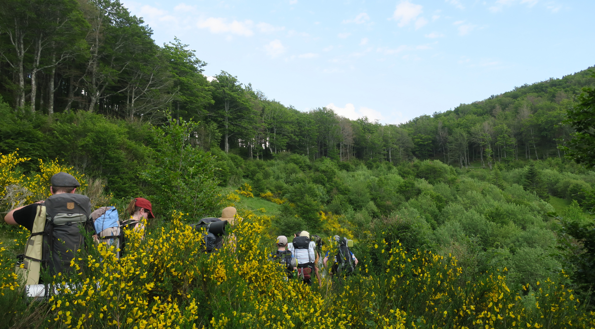
Shortcut through the bushes

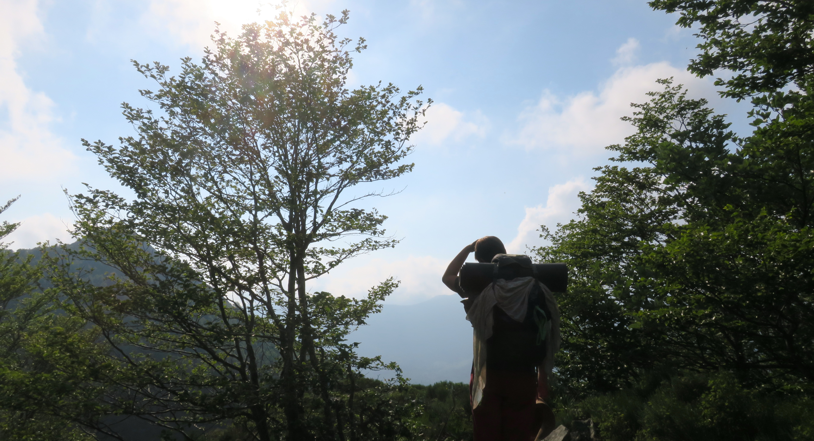
Looking for our friend

It is crazy to think that we actually managed to meet our friend on top of a mountain ridge in the middle of France. Especially in a region where you don’t have phone reception. Two weeks before the hike, we agreed on a GPS location and a time when we would roughly meet and two weeks later we meet on a mountain.

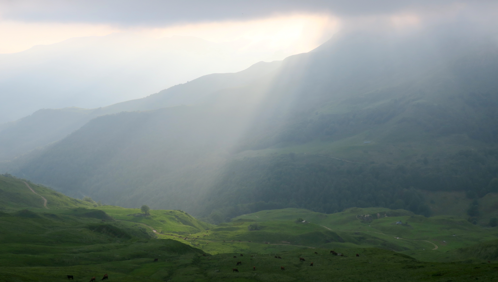
Sun rays breaking through the clouds

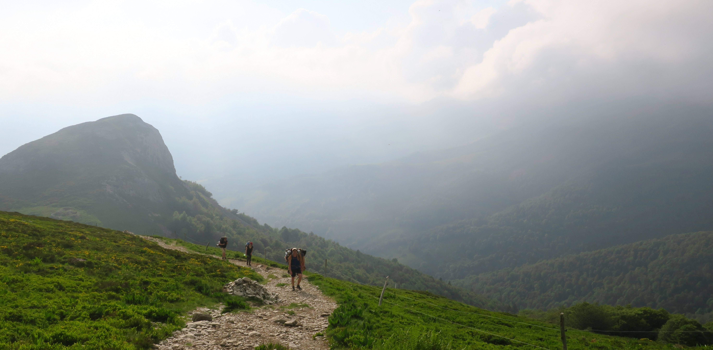
We were finally back in the mountains

Speaking of mountains, we still had to climb 100m at that point but we were finally surrounded with great views again and it cooled down a bit more. We hiked close to **Le Lioran** which, is a famous ski area and we could see the ski lifts. It’s hard to imagine a place covered in snow when you see it in summer at 30°C.

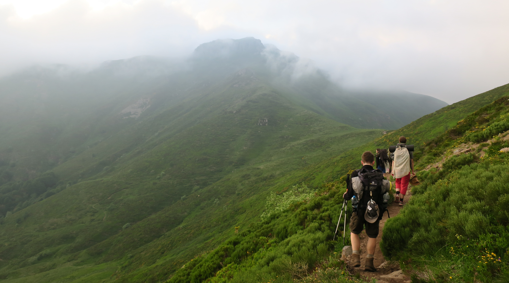
The final meters before camp

Just like the night before we found a great spot to pitch our tents that had an amazing view onto two different valleys. After a short dinner, everybody was very quickly fast asleep in order to recover from this long day.

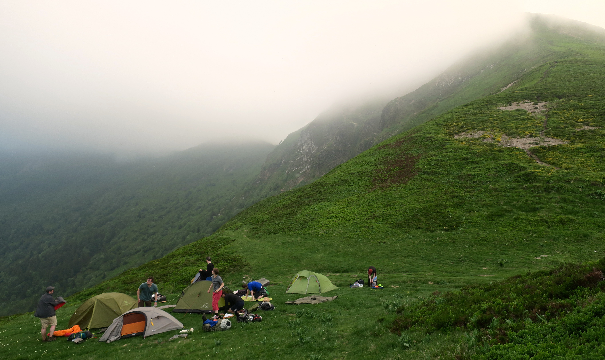
Setting up camp in the clouds

### Day 3: Col de Cabré to Le Falgoux

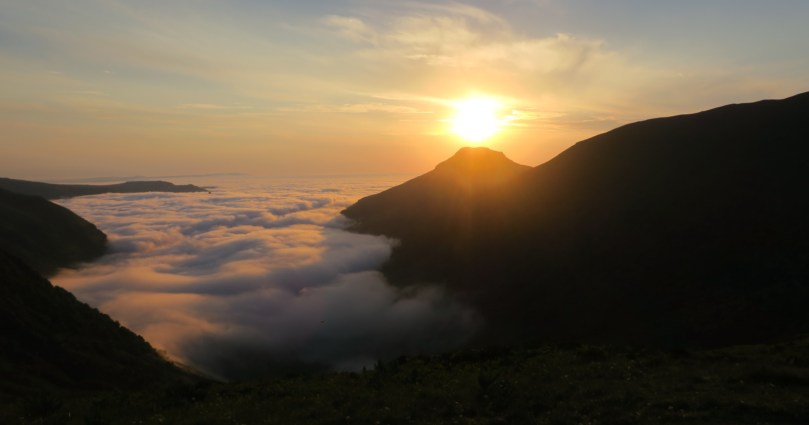
What a sunrise!!

On day three we woke up to a stunning sunrise. Our tents were still covered in morning mist and fog as the golden sun slowly became visible from behind the mountains. All the pain and exhaustion from the previous days was forgotten all of a sudden and we quietly enjoyed this sunrise together all morning.

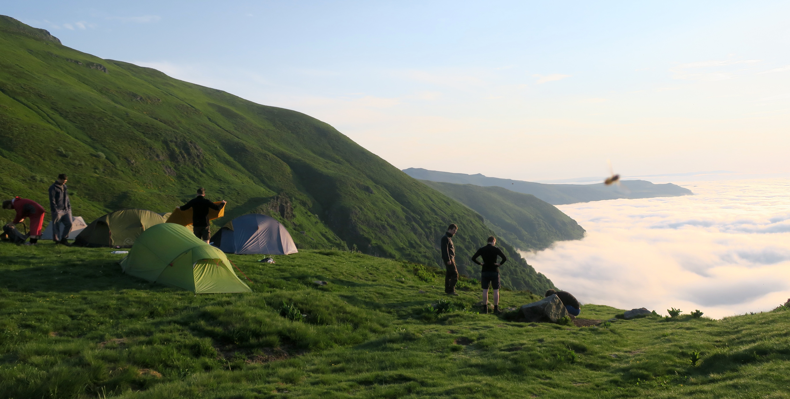
Packing up in the clouds

Along the ridges of the mountains we made our way to this day’s highlight, the mountain **Puy Mary** (1783m) . It was a very relaxed start of the day on mostly plane path until shortly before Puy Mary where we had to climb a 10m stone wall.

Climbing with our backpacks

It was more thrilling than it probably looks on the photos, because you can’t see how far it went down to the left and the right. None of us had actual climbing experience but we all managed, despite our heavy backpacks.

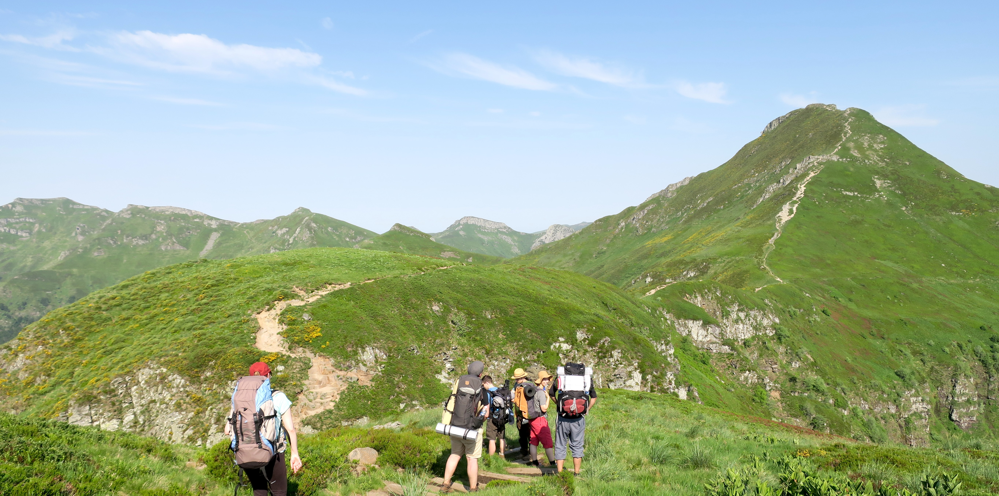
Puy Mary ahead of us

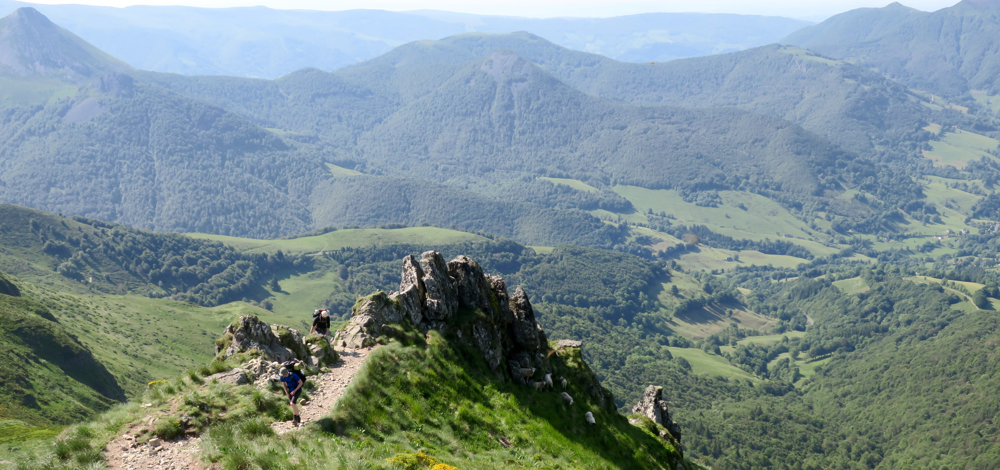
Going up Puy Mary

Puy Mary turned out to be a tough scramble. The ascent is definitely doable for any regular hiker, given that they are not too much afraid of heights and can walk on small ridges without problem. There where no clouds in the sky so we could enjoy the best views onto the Auvergne region from the top.

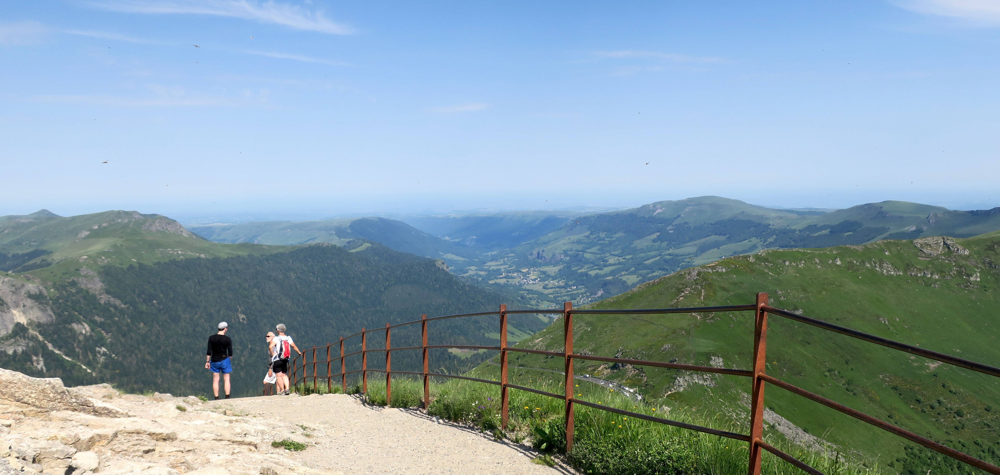
On top of Puy Mary

The perfect reward for climbing the Puy Mary is a big meal at the restaurant that is right at its foot on the northern side. I can highly recommend the **Truffade**, a delicious mix of potatoes and melted cheeses.

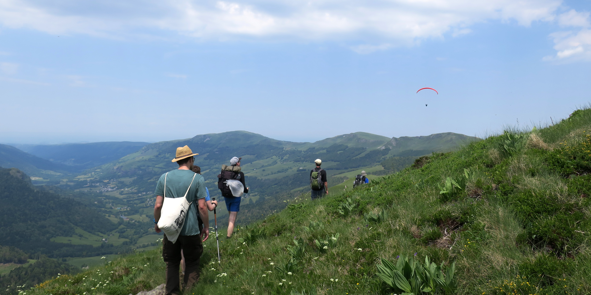
Watching paragliders on our ascend

After a long rest at the restaurant we walked the remaining 12km of the day down into Le Falgoux on a very slight descending slope. We could all feel the exhaustion of the last days in our muscles and bones so we took our time and just enjoyed the view.

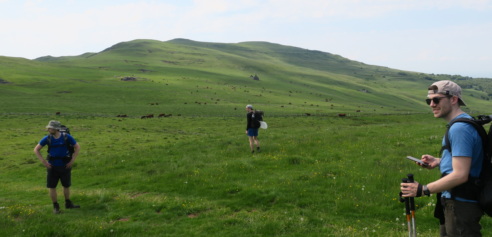
No, we are not lost! ...or are we?

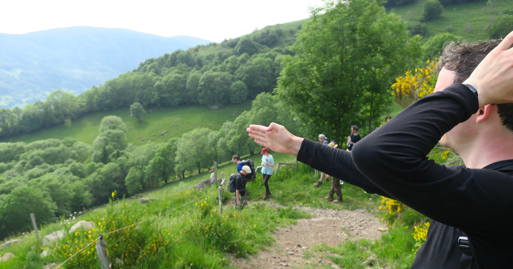
Right down there...probably

Those where three intense days of hiking in the mountains. We were sleeping on top of mountains and always struggling to find water sources. It prove to be the hardest hike that we’d all ever done to that day. I definitely underestimated the strenuous slopes of the mountains. But now I know how to plan better for the next adventures and we’re all looking forward to our next hiking trip.

## Research & Navigation

Most hike descriptions that I found online were written in French and described how to hike the GR400 in its entirety. 133km through the mountains sounded too much for us that summer. I sincerely wanted to make this hike a bit more beginner friendly so I kept searching and stumbled over a hike description on [hikideas.com][].

Instead of the full 133km of the GR400, this path only stretched over 51km which sounded much more doable to me at that point. The description contained a lot of information about how to get to the starting point (in a tiny village), what to do with your car (park it on the church’s parking lot) and tips & tricks for finding places to pitch your tent (since wild camping is still technically illegal in France).

For navigation during the hike I prepared a kml file with Google Maps that contained the path of our hike and imported it into [maps.me][] on my phone. I use this app for all hikes because it has detailed maps with lots or marked trails and water sources. It is as easy to use as Google Maps and you can download all the maps for free.

[gr400 - tour des volcans du cantal]: http://www.gr-infos.com/en/gr400.htm
[hikideas.com]: https://www.hikideas.com/walk-tour-of-the-puy-mary-gr400/
[au bout du monde]: https://google.com
[maps.me]: https://maps.me
