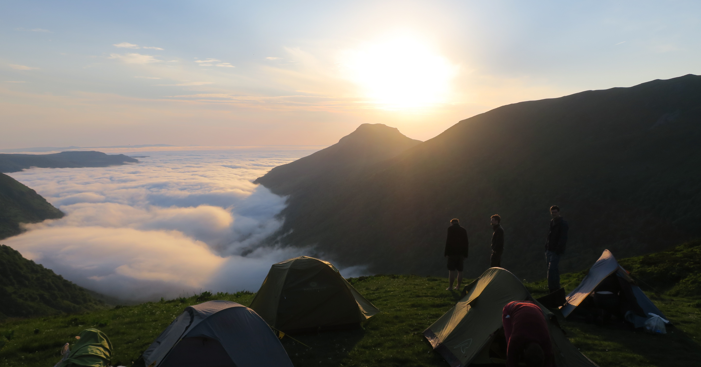

This hike I wanted to be different. I wanted to go into the mountains walking all day under the sun. I also wanted it to be less strenuous than the other multi day hikes before. Little did I know when planning this trip how much more exhausting it is to climb mountains, especially when it’s 30°C all day long.

The Auvergne in France seemed like the perfect beginner region to start mountaineering since the dormant volcanoes in the middle of France are covered in beautiful green pastures and therefore are quite easy to walk and they are easily accessible through public footpaths of the GR400.
Research

    The GR400 is one of the “grande randonnées” in France, publicly maintaned routes of long distance hikes all over France.

Most hike descriptions were written in French though and described how to hike the GR400 in its entirety but 133km through the mountains sounded too much. I sincerely wanted to make this hike a bit more beginner friendly so I kept searching and stumbled over a hike description on hikideas.com.

Instead of the full 133km of the GR400, this path only stretched over 51km which sounded much more doable to me at that point. The description contained a lot of information about how to get to the starting point (in a tiny village), what to do with your car (park it on the church’s parking lot) and tips & tricks for finding places to pitch your tent (since wild camping is still technically illegal in France).

For navigation during the hike I prepared a kml file with Google Maps that contained the path of our hike and imported it into maps.me on my phone. I use this app for all hikes because it has detailed maps for hiking with trails and water sources. It is as easy to use as Google Maps and you can download and use it for free.
Itinerary

The red markers show the places where we pitched out tents and the blue markers are water sources. There were very few ones which was a problem on the first day (which I will get to in just a second).
Stages:

        Le Falgoux to Refuge De Cabrespine (16km)
        Refuge de Cabrespine to Col de Cabré (19km)
        Col de Cabré to Le Falgoux (17km)

Day 1: Le Falgoux to Refuge De Cabrespine (16km)

Le Falgoux, the village at the beginning of the hike is at around 950m which makes it an exciting car ride up the mountains already. When you get out of the car and look at the mountains in front of you, you realize that the hardest part has not even started yet.

It was a super sunny day with 29°C, no clouds, sun glaring above our heads. We made sure to pack 4 litres of water each to make it through the first day, knowing that the first source on our map was 3km into the second day. Luckily, the ascent onto the volcano mountain is routed through the woods. Perfectly soft ground and slightly lower temperatures due to the shade. The slope was pretty intense though. 7km in we already covered around 700m in height and we had more to cover on top of the mountains.
Little break in the forest
Up and up we walk!
Almost made it out of the woods!

Once we made it onto the mountain we were greeted by the green pastures we could see from afar already. It was great to take a break there and just lay in the soft gras and enjoy the sun.
From there on the walk became much easier with less steep slopes and plenty of stunning views to take in. The sun however became a problem at that point because there was no shade anywhere and we had to cover ourselves in thick layers of sunscreen. Mild winds cooled down the heavy heat a bit and it was quite enjoyable to hike about those beautiful green ridges.
That view
Green everywhere
Jep, we have to walk even higher up

A couple of kilometers before the stop for the night we realized we did not have enough water for the remaining route, for cooking that night and for the beginning of the next day. As it was mentioned in the guide it would be hard to find sources during day one so we stopped to check maps.me for water sources and sure enough we found one not too far off the trail. The only problem was, that this source was down a steep pasture and not visible from our location. We had to trust the map data and sent an exploration group down the valley. We lost sight of them and after what seemed an eternity (30min) we could see them again, holding up the filled bottles of water triumphally, cheering. Another success moment for the depleted group which motivated everyone to make it to the finish line today.
The source has to be somewhere down there
Wahooo, we found it
Phew, now we have to walk all the way up

We set up camp next to a former refuge. A perfect camping spot with wind protection, pretty flat with few stones. For dinner we hiked up a little peak where we watched sun go down slowly. Around that time we also had some curious cows coming up to our tents. We probably pitched them at a spot where they usually come in for the night. After licking half our tents and staring at us for about half an hour they could not be bothered by our presence anymore and continued up the mountain.
Day 1 - before evening
Enjoying the view
More hills
Found the refuge!
Perfect place to pitch the tents
That sunrise, tho!
Day 2: Refuge de Cabrespine to Col de Cabré

While the first day started hiking up the mountain, the second day started with a long descent into the valley village of Mandailles. It prove to be a much easier beginning with a 12km hike down the mountain back to 950m altitude from around 1600m. It was luckily less hot in the morning and we walked protected by the forest around noon when the sun got stronger.
Curious cows observing us
day 2 - morning
Down to the valley!!

In Maindailles you find a sweet little Restaurant with great local food. We got introduced to the hearty Aligot which is a mixture of potato mash, butter, cream and local cheeses. Perfect energy refill after a long hike. They also offered steak platters made from the meat of the typical red cows of the region that you would see everywhere along the hike.
Cute village
Resting in the restaurant

We took a longer break at the restaurant because we knew what was ahead of us. We came to Auvergne for the mountains so we had to climb up around 500m again. We also had to be a bit faster this time because we agreed to meet a friend at the top of the mountain at a specific time. So naturally we tried to shortcut the path where we could and most of the time the shortcuts were easy to reach.

Most of them apart from the last one. It was displayed in maps.me as a regular path along a creek. We found the creek, but no regular path. Nonetheless we wanted to get to our meeting point quickly so we started to wade through knee deep foliage with a crazy steep ascent. Hiking sticks and good shoes were definitely helping a lot here but the shortcut turned out to take longer than the regular path in the end. It might not have been shorter but it was clearly the more adventurous option.
Yes, this is supposed t be the shortcut
We should've taken the regular path
At this point, there is not even a path anymore

It is crazy to think that we actually managed to meet our friend on top of a mountain ridge in the middle of France in a region where you don’t have phone reception. We agreed on a GPS location before we embarked on our journey and a week later we meet on a mountain.

Speaking of mountains, we still had to climb 100m at that point but we were finally surrounded with great views again and it cooled down a bit more. We hiked close to Le Lioran which, in winter, is a famous ski area and we could see the ski lifts. It’s hard to imagine a place covered in snow when you see it in summer at 30°C.

Just like the night before we found a great spot to pitch our tents that had an amazing view onto two different valleys. After a short dinner, everybody was very quickly fast asleep in order to recover from this long day.
Rocky paths
Ski lift in summer
Great view on the other mountains
Again, a perfect place to pitch the tents
Day 3: Col de Cabré to Le Falgoux

On day three we woke up to a stunning sunrise. Our tents were still covered in morning mist and fog as the golden sun slowly became visible from behind the mountains. All the pain from the strenuous days before was forgotten all of a sudden and we quietly enjoyed this once in a lifetime sunrise.
What a sunrise
Watching a sunrise from above the clouds
Watching the clouds

Along the ridges of the mountains we made our way to this day’s highlight, the Puy Mary. It was a very relaxed start of the day on mostly plane path until shortly before Puy Mary where we had to climb a 10m stone wall. It was more thrilling than it probably looks on the photos, because you can’t see how far it went down to the left and the right.
Easy start of the day
Yep, you have to climb up here
The scramble
Puy Mary in sight

Puy Mary also turned out to be a nice scramble. The ascent is definitely doable for any regular hiker, give that they are not too much afraid of heights and can walk on tiny ridges without problem. There where no clouds in the sky so we could enjoy the greatest views onto the Auvergne region from the top. The perfect reward for climbing the Puy Mary is a hot meal at the restaurant that is right on its foot on the northern side. I can highly recommend the Truffade, a delicious mix of potatoes and melted cheeses.
Tiny ridges
It won't stop
Gotta take a little break

After a long rest at the restaurant we walked the remaining 12km of the day down into Le Falgoux on a very slight descending slope. We could all feel the exhaustion of the last days in our muscles and bones so we took our time and just enjoyed the view.
Watching the paragliders
Resting in the shadow of this giant rock
Nope, we're definitely not lost
This way...I think

Those three intense days of hiking in the mountains, sleeping only in the wild and struggling to find water sources prove to be the hardest hike that we’d all ever done. I definitely underestimated the strenuous slopes of the mountains. But now I know how to plan better for the next adventures and we’re all looking forward to our next hiking trip.
