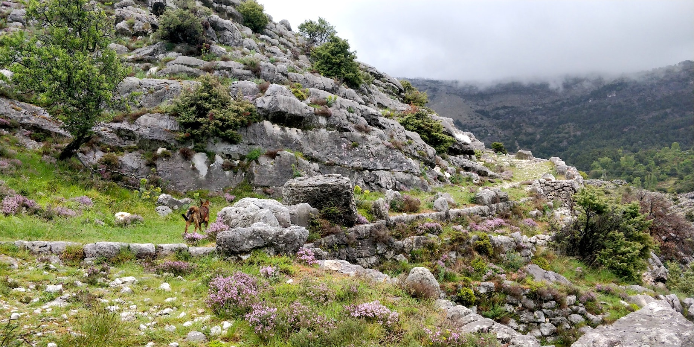
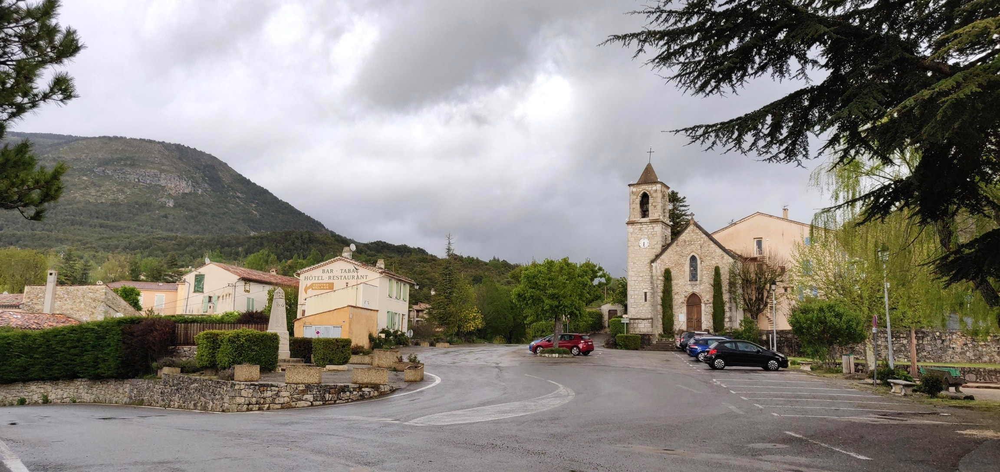

The Verdon river is one of the most beautiful places to stay and hike in the south of France. On this trip we are starting on the "ancienne route Napoléon" in Saint-Vallier-de-Thiey from where we are slowly making our way to the Verdon gorge over mountains, through forests and tunnels. This trip had it all: nights with freezing temperatures and days with 30°C and no shade; long stretches of flat and easy dirt roads and near vertical ascends on exposed rock formations.

<!-- more -->

## Map

<iframe src="https://www.google.com/maps/d/embed?mid=1YMmSCt4JV_HSGxPO1I6jtFBqy-Awqq9f"></iframe>

## Sections

1. [Saint-Vallier-de-Thiey to Cascade du ray (??km)](#section1)
1. [Cascade du ray to La Roque Esclapon (??km)](#section2)
1. [Roundtrip to Château Sabran de Pontèves from Camping Notre Dame (??km)](#section3)
1. [Roundtrip to Trigance from Camping Verdon Carajuan (??km)](#section4)
1. [Le Point Sublime to Chalet de la Maline along the Verdon (??km)](#section5)
1. [Chalet de la Maline to Lac de Sainte-Croix (??km)](#section6)

### Day 1: Saint-Vallier-de-Thiey to Cascade du ray (??km)

Nice -> Grasse -> LER 31 -> Saint-Vallier-de-Thiey

Forest in Saint-Vallier-de-Thiey

Valley walk with the dog

Valley views

Ancienne Route Napoléon

Church on the Ancienne Route Napoléon

Found a campsite in a small forest

### Day 2: Cascade du ray to La Roque Esclapon (??km)

Catching the morning sun

Just before the cascade du ray waterfall

Refilling the water bottlels with fresh water from the waterfall

Rock climbing with backpacks on

More climbing

Storm ahead

Arrival in La Roque Esclapon

Warming up at the campsite

### Roundtrip to Château Sabran de Pontèves from Camping Notre Dame (??km)

The weather looks a lot more promising in La Bastide

Enhoying pastries in a boulangerie in La Batisde

Slack-packing to the Chateau

Passing by some horses

We seem to attract dogs everywhere we go

Made it to Château Sabran de Pontèves

Mingling with more horses on the way back

### Roundtrip to Trigance from Camping Verdon Carajuan (??km)

A first glimpse of the Verdon river

The verdon river bed

Looking back to the mountains

Arriving in Trigance

Checking out the local bakeries

Climbing the stairs to the castle

Dinner at the campsite

### Le Point Sublime to Chalet de la Maline along the Verdon (??km)

Point Sublime in the fog

Colorful rock formations at Point Sublime

The beginning of the Gorge du Verdon

Climbing on stones nezt to the verdon

Entering the tunnel

Beautiful views of the verdon

Looking into the canyon after the tunnel

Walking through the canyon

Lunch in the canyon

Climbing along rails in the canyon

Lots of climbing up and down on rails

Refilling the water from the verdon

Happy to have arrived at Chalet de la Maline

Vegetarian dinner prepared by Chalet de la Maline

### Chalet de la Maline to Lac de Sainte-Croix (??km)

The canyon covered in morning mist

Making our way down to the verdon again

Stunning views into the gorge

And the rail climbing continues

Relaxing after a climbing section

Near vertical ascend at Le Styx

More vertical climbing

We made it to the top of Le Styx

Spotting hikers on the other side of the canyon

Almost at the top of the hill

Beautiful views on Lac de Sainte-Croix

Descendind towards the campsite by Lac de Sainte-Croix

Camping with lake views
