The Verdon river is one of the most beautiful places to stay and hike in the south of France. On this trip we are starting on the "ancienne route Napoléon" in Saint-Vallier-de-Thiey from where we are slowly making our way to the Verdon gorge over mountains, through forests and tunnels. This trip had it all: nights with freezing temperatures and days with 30°C and no shade; long stretches of flat and easy dirt roads and near vertical ascends on exposed rock formations.

<!-- more -->

## Map


<hike-map></hike-map>


## Sections

1. [Saint-Vallier-de-Thiey to Escragnolles (19km)](#section1)
2. [Escragnolles to La Roque Esclapon (17km)](#section2)
3. [Roundtrip to Château Sabran de Pontèves from Camping Notre Dame (15km)](#section3)
4. [Roundtrip to Trigance from Camping Verdon Carajuan (11km)](#section4)
5. [Le Point Sublime to Chalet de la Maline along the Verdon (15km)](#section5)
6. [Chalet de la Maline to Lac de Sainte-Croix (21km)](#section6)

### Day 1: Saint-Vallier-de-Thiey to Escragnolles

(19km, 9h30, [komoot](https://www.komoot.com/tour/69515519))

After a rainy but relaxed evening in **Grasse** (which is very easy to reach via **Nice**), we took the earliest **[LER 31](https://services-zou.maregionsud.fr/fr/horaires/Zou-LER/Bus/ligne/LER-31/direction/OUTWARD/919)** bus towards **Saint-Vallier-de-Thiey** which marked the beginning of the hike. While the bus slowly made its way up the mountain, we enjoyed the stunning views all the way to the ocean.

From the city center we followed a small pedestrian path into a dense and still slightly humid birch forest. The ground was still soft from the rain of the previous night which made it easier for us to walk with our very heavy backpacks. They were extra heavy on this trip because we knew we did not have many options to resupply along the trail so we carried almost all food for all six days from the beginning.

After the forest opened up, we reached our first valley views and the next couple of kilometers we went up and down small hills alongside the valley. In the forest we noticed that a dog was following us. It did have a harness but no tag and it looked pretty weak. We gave it some water and from that moment on it became very attached to us. We tried several times to tell it to go back to its owner but it did not listen and it stubbornly followed us.

We could see that the weather was getting worse and we luckily walked through forest again when it started to rain so it did not hit us as much.

When the rain stopped, we started our biggest ascend for that day on the **ancienne route Napoléon**, an old trading route with great views of the valley. We followed it all the way up to **La Colette** right before **Escragnolles** where we took a small break and managed to communicate to some locals that they call the animal shelter to take care of the dog.

We did not mind the dog but when we arrived at the road, it started to chase cars and almost got itself killed, so we thought it would be best to get it into the hands of professionals.

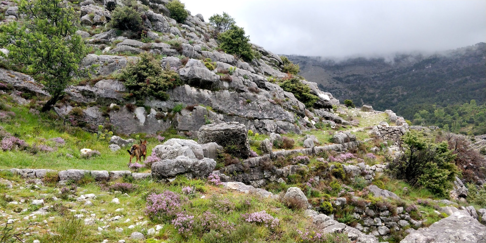

From La Colette we walked down to and through Escragnolles on the lookout for a hidden campsite. Just outside of Escragnolles, half way to the **Cascade du ray** waterfall, we found a small forest that fit our tents perfectly. It was far away from the village and nobody could spot us from any of the surrounding streets.

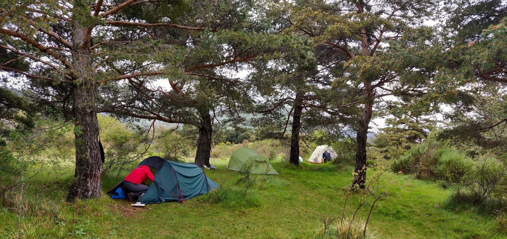

### Day 2: Escragnolles to La Roque Esclapon

(17km, 7h45, [komoot](https://www.komoot.com/tour/69519813))

The sun was shining on us all morning and we were able to dry all our clothes and the tents. Without the clouds we now also had a great view of the valley that we slept in. After a long breakfast we started to hike towards the rushing waterfall that we heard in the distance since the night before.

It was just a couple hundred meters further that we arrived at **cascade du ray**. I don't actually know how high it was because it was hard to find onformation on it on the Internet. It was just a mere accident that I saw it on the maps and routed the hike this way. I had a hunch that this would provide a great view early in the morning which it definitely did.

With our water bottles full of fresh water, we then started the ascent onto the plains behind the waterfall. Beforehand its complicated to understand how much of a scramble this section would be. If I had known that we had to go on a proper vertical ascent with our full backpacks, I think I would have not routed us this way. But in the end I'm happy we did. Even though it was sketchy at times, the feeling of achievement and the great views were totally worth it.

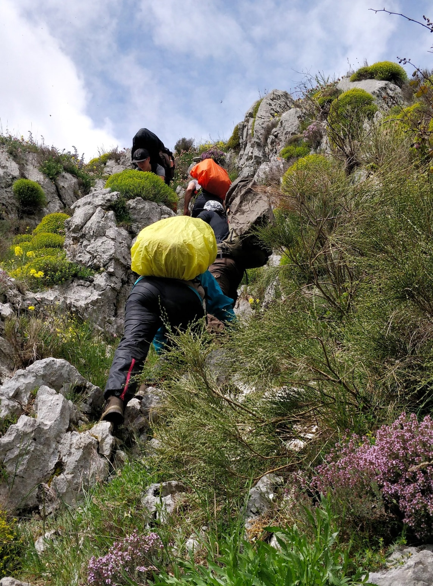

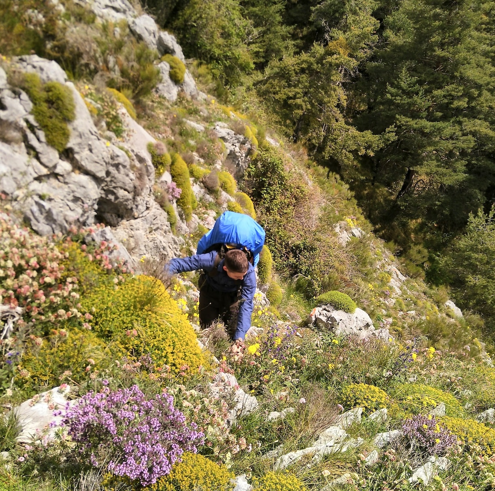

The plains proved to be rather boring but also quite easy so we made good progress. We still had to meet up with a friend who wanted to join us in the second half of the day and it looked like we could actually make it to the meeting point in time.

These meetings in the middle of hikes are kind of a tradition for us by now and we have become quite good at it. We agreed to meet around a certain GPS position at specific time but without cell connection we would have to hope for the best outcome. When we started to hike up the hill with the meeting point it started to rain heavily and had to take cover in the bushes. It was then when we heard our friend walking down the main path, singing his hiking jingles, enjoying his little walk under the rain by himself. We made it again, we managed to meet in the middle of nowhere with no way to communicate. This little win and a quick snack break filled up our energy reserves to make it over this hill.

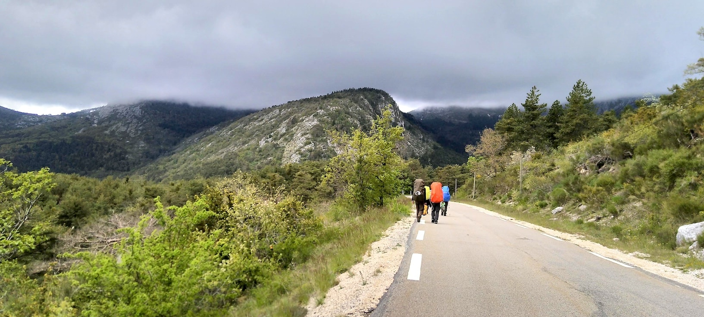

The rain continued for the descend down the hill and only stopped when we arrived in the village of **La Roque Esclapon**. We got quite cold and in the end decided to rent a "three room tent" with a small kitchen and a small heater. This simple tent felt lavish to us and it did well to lift up our mood. We had a hearty dinner, played some games and just enjoyed each other's company. Finding sleep was not a problem that night.

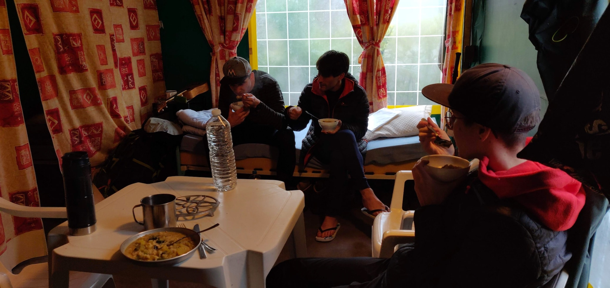

### Roundtrip to Château Sabran de Pontèves from Camping Notre Dame

(15km, 6h, [komoot](https://www.komoot.com/tour/69522371))

Since the previous day was so exhausting, we decided to take it easy for a day. Instead of continuing on the planned route, we decided to go on a round-trip hike to a former castle (**Château Sabran de Pontèves**) in **Bargème**. With only snacks in our backpacks and the sun shining again, we lloked forward to a more relacing hike. Out first stop was the village of **La Bastide** where we found a cute boulangerie with amazing pastries.

From there we hiked up the mountains over several farmer's pastures onto the path to the old castle. It was easy walking from there on and we took long brakes on the side of the path. We could see the castle in the distance the entire time and we were looking forward to stop there for lunch.

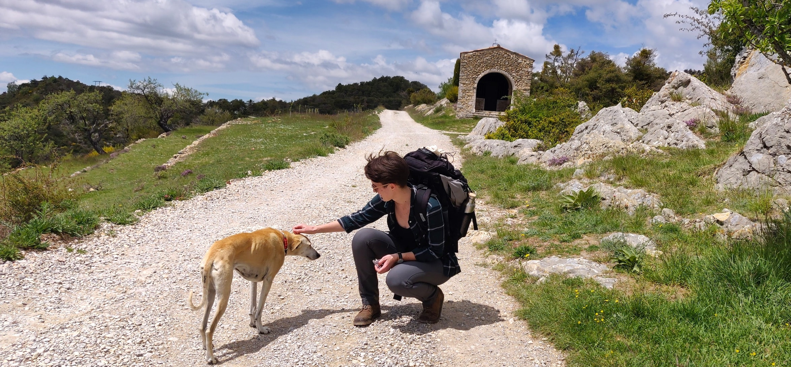

The village of Bargème was even smaller than we expected. It's just a couple houses, an old church, the old castle and a small restaurant. If we had not had our own lunch with us, we would have definitely checked out the restaurant. The views we had from the castle back into the valley were stunning and we took our time relaxing there for quite some time.

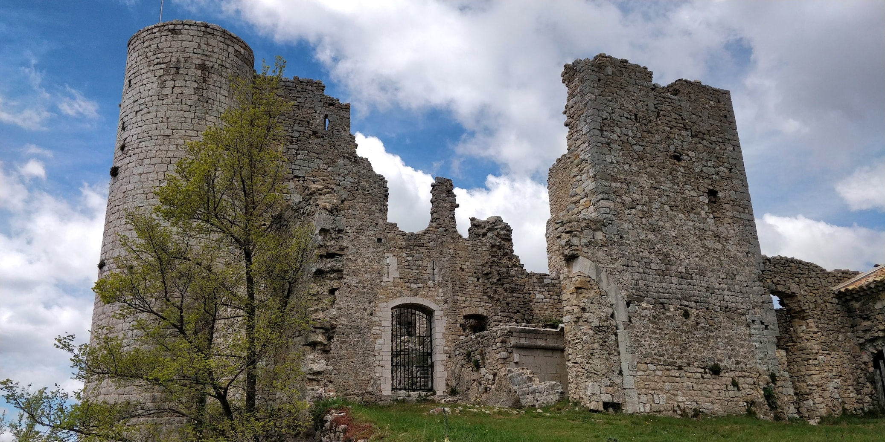

On the way back we could see rain clouds coming our way so we hurried up but made it back just in time before it started to rain. We had another lovely dinner in out well-protected tent and our final hot shower at that nice campsite. The owners were super lovely, answering all our questions and were always up for a chat. They even offered to drive us to the next campsite on our trip because we would otherwise have to walk on the street for a long time. And who are we to not take them up on that offer?

### Roundtrip to Trigance from Camping Verdon Carajuan

(11km, 5h, [komoot](https://www.komoot.com/tour/69523556))

Our lovely hosts dropped us off at **Camping Verdon Carajuan** in the morning, we set up our tents there and again decided to go on a roundtrip hike. The medival village of **Trigance** promised to be a nice destination with an old castle, lovely small streets and a couple shops selling local goods and foods. It was at that campsite that we also saw the Verdon river for the first time. The river that would be at our side for the next two stages on this hike.

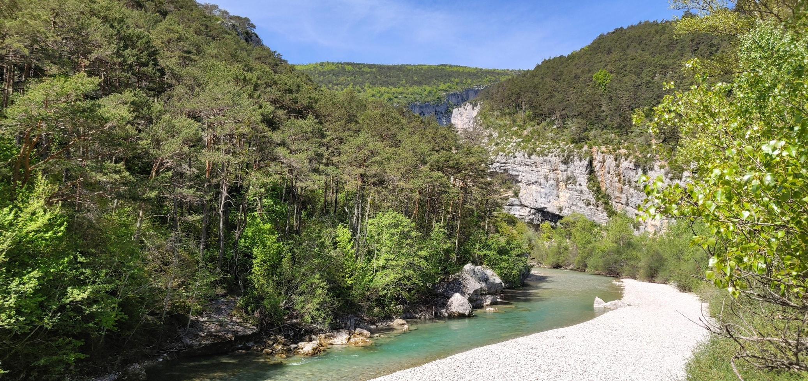

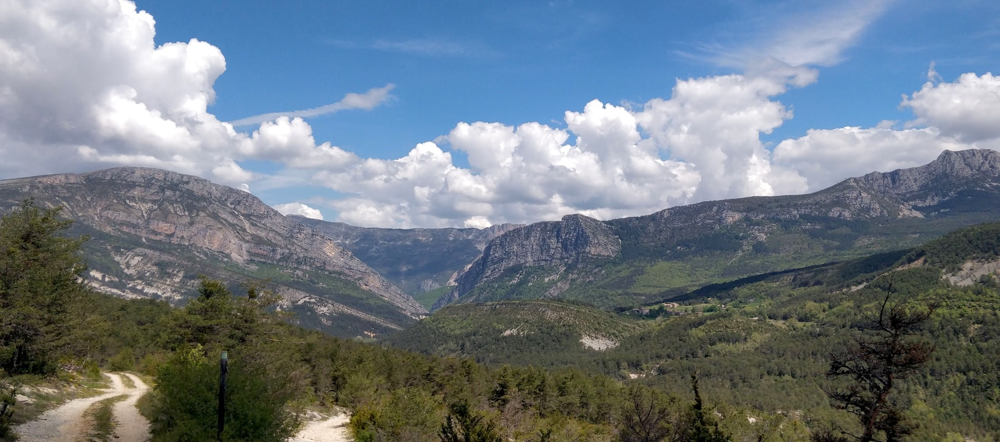

To Trigance it's an easy walk along the river. There are several opportunities to cool down your feet in the mysteriously blue-green river. The slope is gentle and the higher up you get, you're rewarded with views of the mountains around and the village in front. We only packed water and snacks, knowing we would be able to grab some local food in town.

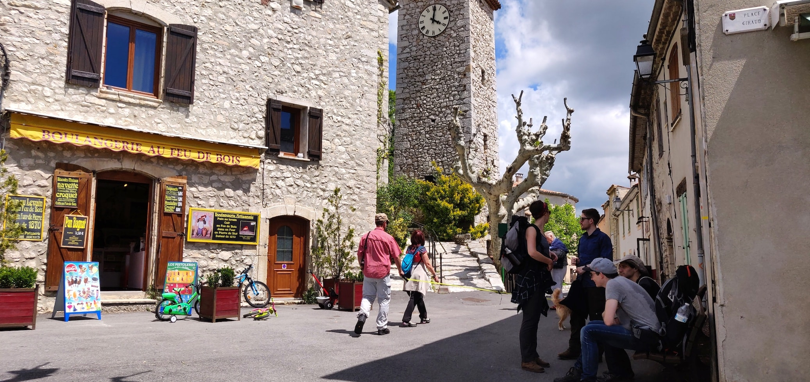

Wandering through the cute tiny streets, we found fresh bread, local cider and ice cream which made for the perfect indulging lunch. There's not much to do in the village itself but it is cute to look at. The castle, which is slightly higher up the mountain, was closed that day but we managed to get onto a viewing platform from where we saw an upcoming storm. Naturally, we started to slowly walk back to the campsite.

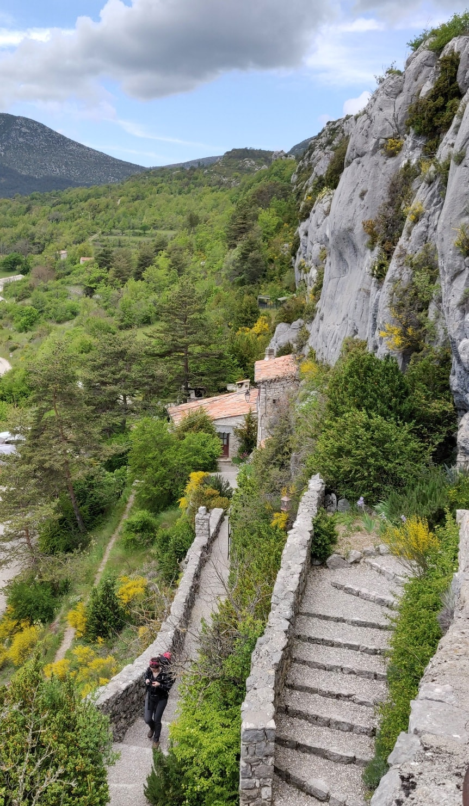

When we arrived back at the campsite, the storm had cleared and the sun had come out again. We took it easy, took long showers and prepared dinner on the barbecue. After a short round of card games, we went to bed early, knowing well that we had to get up early and in time for the bus in the morning.

### Le Point Sublime to Chalet de la Maline along the Verdon

(15km, 8h50, [komoot](https://www.komoot.com/tour/69525965))

The bus from the campsite to **Le Point Sublime** takes only a short while. You could potentially hike there, but it's along the windy mountain road. I wouldn't recommend it since there is no dedicated foot path and walking on the road seemed quite unsafe to be fair.

From Point Sublime we made our way down the path along the rock face, though light vegetation. The valley was still covered in fog, the stone was humid and the weather looked like it would become a rainy day again. At the foot of the mountain, we had a great view onto the baby blue Verdon.

The water is super clear here. The river bed full of stones. There are warning signs everywhere warning you from sudden rising water levels when it rains and when a nearby water reservoir is opening its valves. It's better not to set up camp on those stones, might become a wet endeavor.

Shortly after reaching the river, we walked through the first tunnel. The tunnels are pitch black and bringing your own lamp is advised. The ground is also pretty wet and full of puddles that are deeper than they seem. I don't really remember how long the longest tunnel was, but I think it was around one kilometer.

Every now and then, there are lookouts in the tunnel and you can see the beautiful river valley from the top.

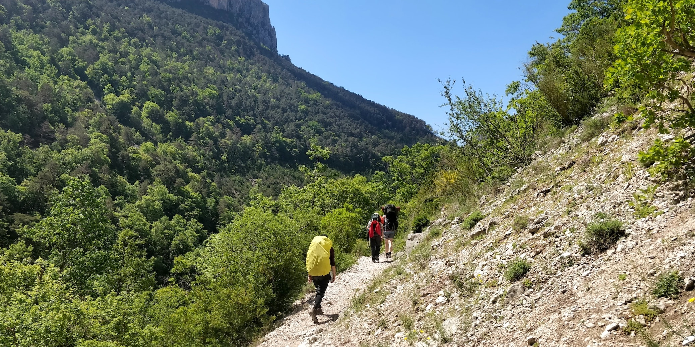

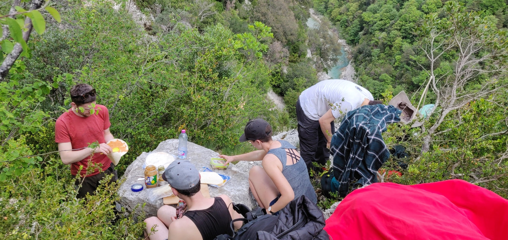

The weather also took a turn and started to get really sunny at that point. Which made for much better views ☀️. A lunch on heated rocks, in the midday sun was the perfect time off from a strenous morning walk.

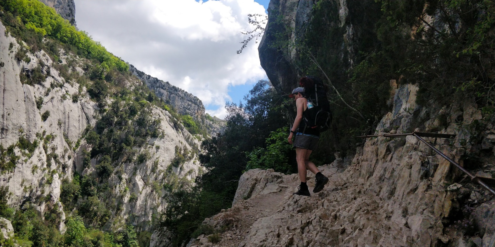

The path winds around many corners, goes up and down a lot. Some parts of the path are bare rock and you need to hold tight onto the railings. Verdon is peaking through the bushes from time to time. With heavy backpacks, this path can be quite demanding. Luckily we already ate most of our food, so the packs were substantially lighter.

We still had to carry our tents, sleeping- and cooking equipment though. We later found out that there would've been the option to ask a local taxi company to bring the packs to the Chalet or the next campsite. An option we might take, next time we're in the area.

Once we made it down the valley again, we could refill our watter bottles in the Verdon. The heat was very intense at that point so we took a longer break. Cooling down our feet in the ice cold water was the greatest thing on earth for us. We knew we had to rest up a bit, because the final stretch that day was all the way up the edge of the valley again to **Chalet de la Maline**.

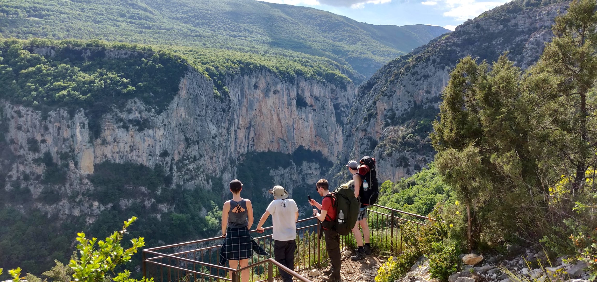

The last hours felt long and morale took a little hit again. Our packs felt heavy and the propsect of only walking uphill for the last bit was a challenge. We were motivated knowing that at the end of the day we will sleep in proper beds and we won't have to cook dinner ourselves, haha. Also, the views from up there, made up for it 100%.

Resting on the chalet's patio, overlooking the valley felt amazing. We felt accomplished. Physically exhausted, but mentally stronger. We made it all the way here. Down and up and down and up the valley.

We were greeted by the nice host, chatted with other hikers and enjoyed a multi-course dinner made from heaven. They were even so nice to prepare a vegetarian version for our crew. The evening was spent haring stories with the host over the one or the other glass of wine. The morale was up again 🤩.

### Chalet de la Maline to Lac de Sainte-Croix

(21km, 11h40, [komoot](https://www.komoot.com/tour/69530357))

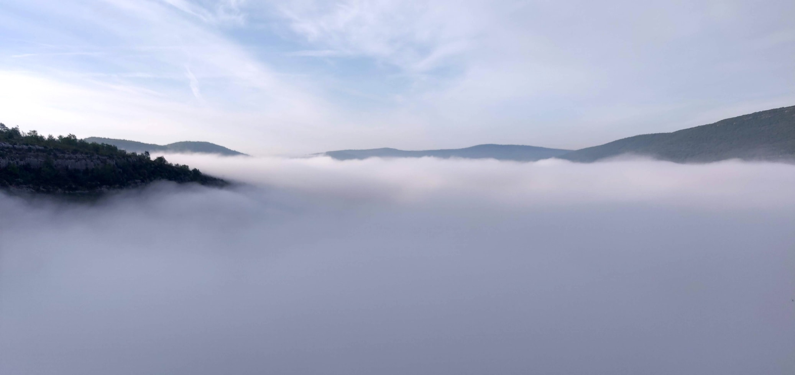

An early morning start on the final day of the trip. The valley was still covered in mist when we started the descent back into the valley. It cleared off quickly and the views became better. This section of the trip we expected to have the most spectacular scenes and we were not disappointed.

We hiked along the left-hand side of the river. The sun was very intense early in the morning but we were lucky to find protection in the shade of trees. The cool breeze next to the Verdon cooled us down as well.

The path was rather wild at this stage but the scenery made up for it. We could see far ahead into the gorge. The blue water, green trees and bare rock faces made for such a nice combination.

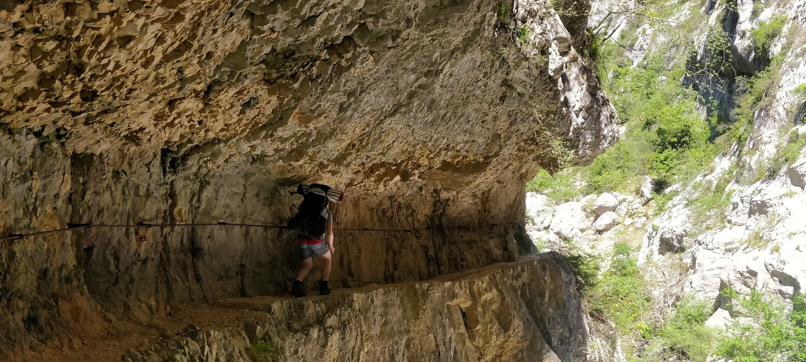

After two or three hours, the path became more rocky. The rock was dry so it wasn't very slippery but some of it was crumbling under our feet. Holding onto the railing tight was priotity number one at this point. At no point did it feel unsafe though. We knew it would get a bit more wild and were ready for the challenge.

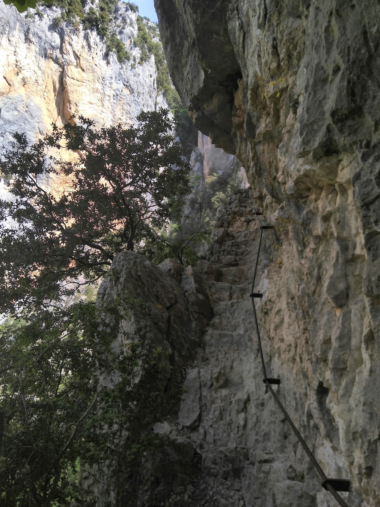

We took a longer break when we arrived at the bottom of **Le Styx**. It's a near vertical ascent from there to the top of the valley. Even without backpacks this would prove a challenge to a lot of people and we could see hikers coming down the "path" because it felt too unsafe for them.

The pictures don't do the challenge justice. The track was bare rock, very uneven "steps", crumbling stones and a vertical fall right next to you. Every once in a while we would reach a small forest that we used for small breaks. The last part was a near vertical ascend on forest ground without railings. At some point we had to walk on all fours in order not to slide. We understood why some hikers turned around at this point.

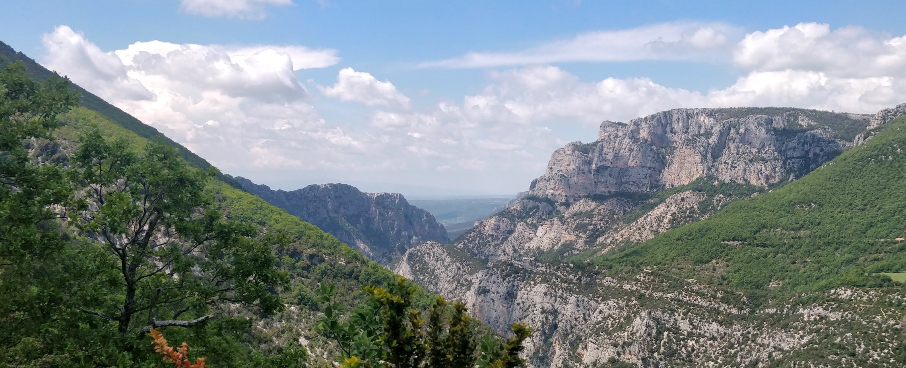

We pretty much collapsed right after making it up Le Styx. The views and a hearty lunch made up for it. This was the most intense climb that our group had to face so far. Though we were exhausted, we definitely felt accomplished.

Far in the distance we could already spot the end of the Verdon canyon which marks the beginning of **Lac de Sainte-Croix** where we would set up camp that night. It would still be a long hike all the way there though. And it would be a longer hike than it should have been.

The maps for this section were a bit thin. I decided for a path close to the canyon's cliff. I thought it would make for a more scenic route than the option along a street without a view of the canyon. On paper it was the right decision. In reality though it turned out that the "path" was not maintained at all. It was overgrown, had several sketchy scramble sections, crushed rock crossings and hardly good views into the canyon (because of all that foliage 🌱).

There are very few pictures of that section, even though it was by far the longest that day. The morale was going down whenever we noticed how slowly we were progressing. On top of that we were running out of water and there were no options to refill. Still, looking back at it, it was quite the experience to remember.

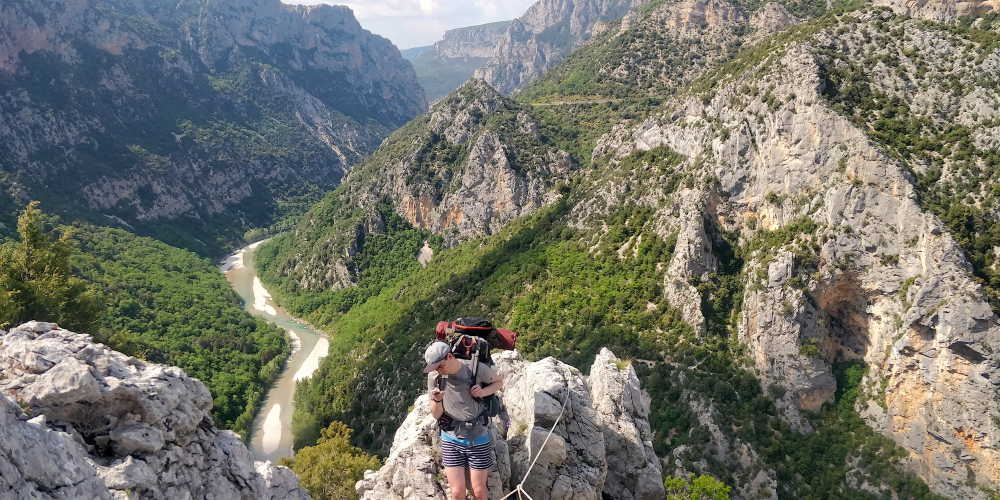

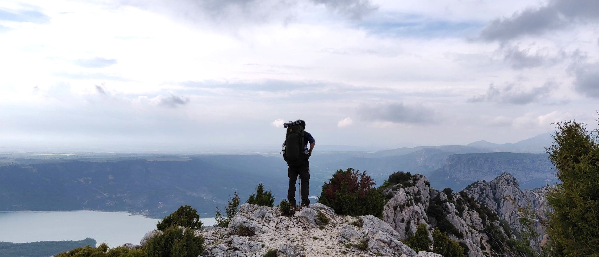

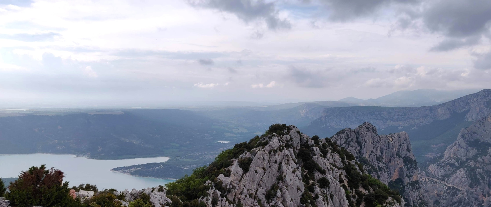

The end of that stretch marked a hill climb that gave us great views onto the lake (**Belvédère du col d'illoire**). We would have hung out there longer if it wouldn't have been for rain clouds in the distance and the lack of water. In hindsight we should've stayed there longer because the views were so nice. If you ever happen to be in the area, make sure to check out this spot. It's also easy to reach by car.

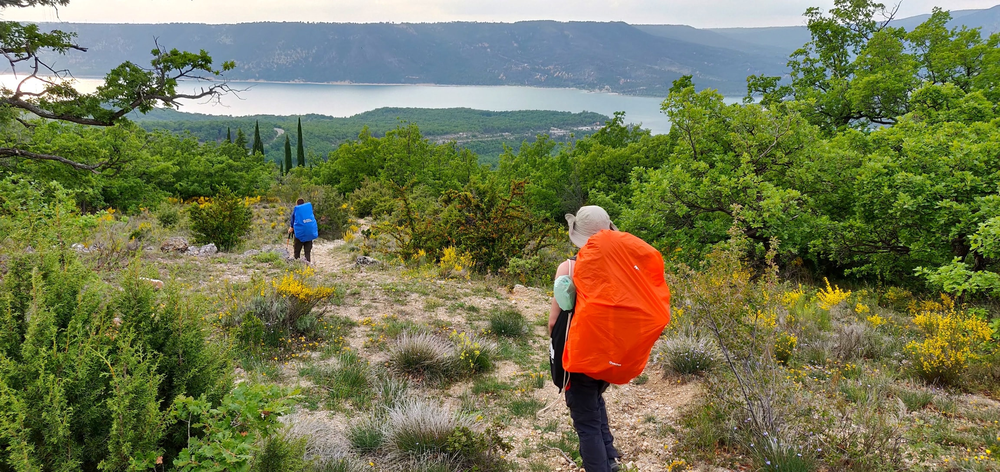

The path to the our campsite (**Camping le Galetas**) was an easy one. A gentle downward slope, easy terrain and very nice people on the way that filled up all our water bottles. Moods started to lift and we already started to talk about our highlights of the trip. The nice campsites, the views, the canyon, local food, the great company.

We were super exhausted but still managed to cook a big leftover dinner. We pitched our tents at an elevated patch of grass with direct view onto the lake. After a hot shower we all fell asleep immediately.

The next day we used buses that brought us all the way back to Nice. They took the canyon street that we could see from the other side for so long. After a meager half an hour the bus left the canyon. A distance that took us two days by foot 😅
